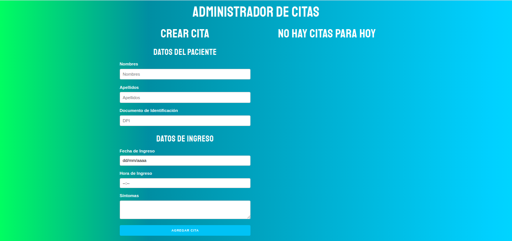

# Proyecto Citas con REACT JS

[](https://app.netlify.com/sites/laughing-turing-34a97e/deploys)

Administrador de citas, donde creamos un formulario para crear citas y que estas se almacenen en el local storage para que al recargar la página esas citas no se pierdan y sigan estando en el sitio.

¿Que podemos hacer con este sitio?
  - Crear una cita
  - Guardar una cita (en el Local Storage)
  - Eliminar cita


### Instalación
Primero debes clonar este repositorio

```sh
$ git clone https://github.com/Geracros13/Proyecto-citas.git
```
Una vez clonado el repositorio, entra a la carpeta 

```sh
$ cd Proyecto-citas/
```
Y luego debes instalar las dependecias que necesita para funcionar (debes tener instalado Node)
```sh
$ npm install
```
Cuando se terminen de instalar las dependencias, ejecuta este comando y listo!!
```sh
$ npm start
```

### Resultado final:



## Contacto
[Linkedin](https://gt.linkedin.com/in/manuel-flores-abb71a15a/%7Bcountry%3Dno%2C+language%3Dno%7D?trk=people-guest_profile-result-card_result-card_full-click)
[Twitter](https://twitter.com/Gerardo_fq)

